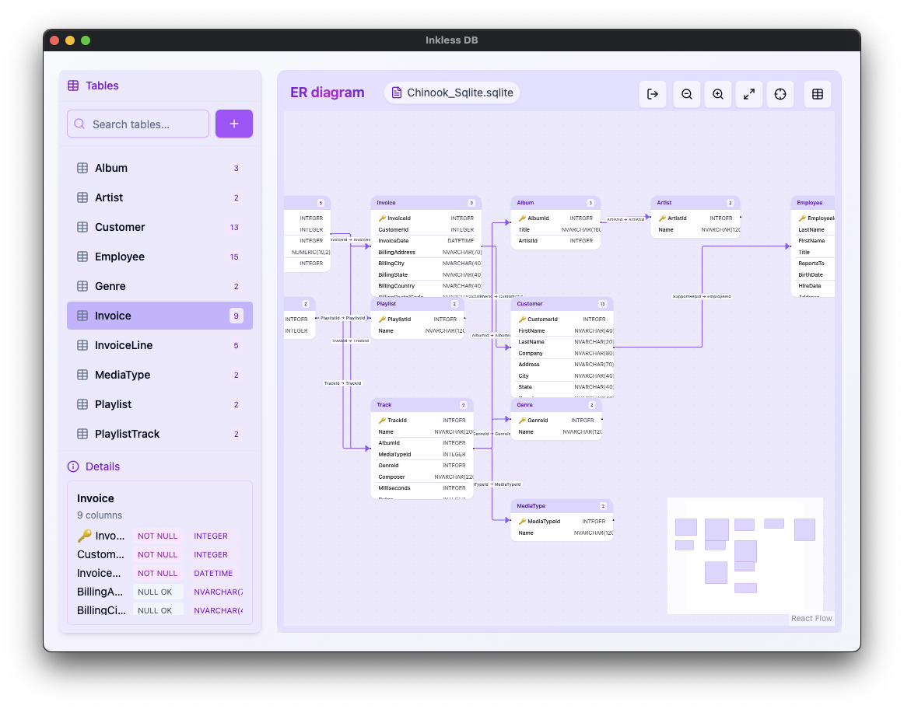

# Inkless DB

[](https://github.com/shou-taro/inkless-db/actions/workflows/ci.yml)
[](https://github.com/yourname/inkless-db/releases)
[](./LICENSE)

> Inkless DB is a modern, cross-platform desktop application for SQLite, PostgreSQL, and MySQL.  
> Its unique concept is "inkless": you can explore, visualise, and manage databases entirely through the GUI — no queries required.  
> This provides a lightweight, intuitive way to understand and work with your data.

## ✨ Features

- Open SQLite files via file picker or drag & drop
- Automatic ER diagram layout with directional relationship arrows
- Schema browser showing column details including types, primary keys, and nullability
- Data preview displaying the first 10 rows instantly
- Planned: full table browsing, GUI-based filtering, and editing



---

## 🚀 Installation

### Prerequisites

- Node.js and pnpm package manager
- Rust toolchain (for building Tauri backend)

### Pre-built Binaries (Coming Soon)

Downloadable from [GitHub Releases](https://github.com/yourname/inkless-db/releases).  
Supported platforms: macOS, Windows, Linux.

### Build from Source

```bash
# Clone the repository
git clone https://github.com/yourname/inkless-db.git
cd inkless-db

# Install dependencies
npm install

# Run in development mode
npm run tauri dev
```

---

## 🛠 Tech Stack

- **Frontend:** React (Vite), shadcn/ui, React Flow (ER diagram rendering)
- **Desktop:** Tauri v2
- **Backend:** Rust with SQLx, SQLite

---

## 📌 Roadmap

- Full-featured Data Workbench: table browsing, filtering, editing
- Support for PostgreSQL and MySQL databases
- Enhanced ER diagram layout: overlap avoidance, improved readability
- Query result visualization with graphs and charts

---

## 📄 License

This project is licensed under the MIT License.  
© 2025 Shoutaro Miura
